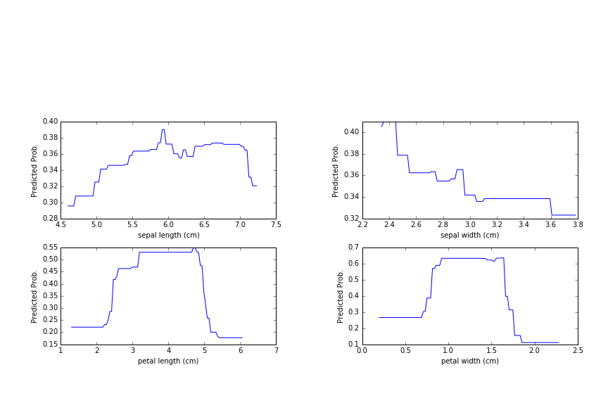
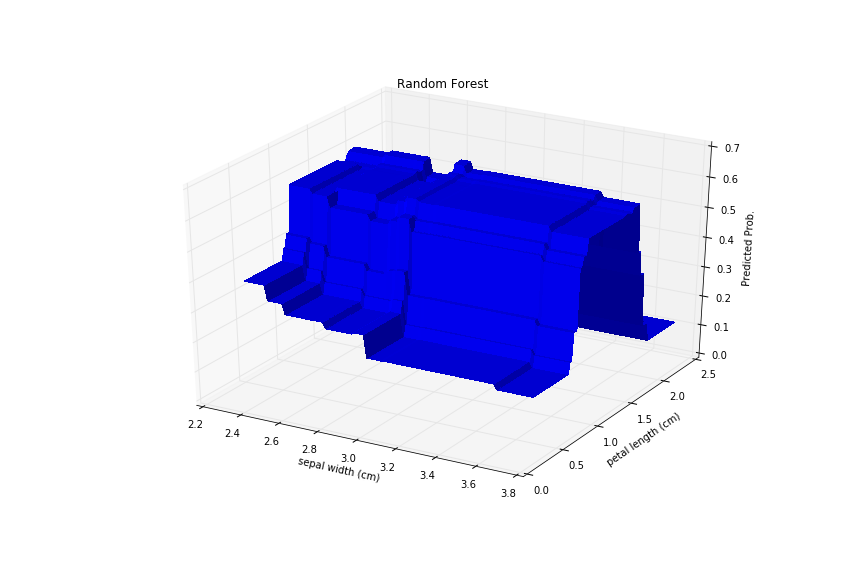
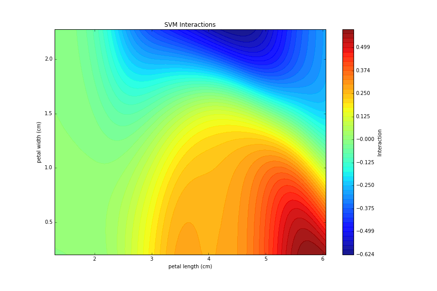

## Partial Dependence and Feature Interaction Plots

Module for making partial dependence plots for arbitrary sklearn classifier. 

## Installation

import partial_dependence. See Eample notebook for more details. 

## Comparisons

### Single feature partial dependances (Random Forest)

### Feature pair partial dependances (Random Forest)

### Feature interaction plot (SVM)
